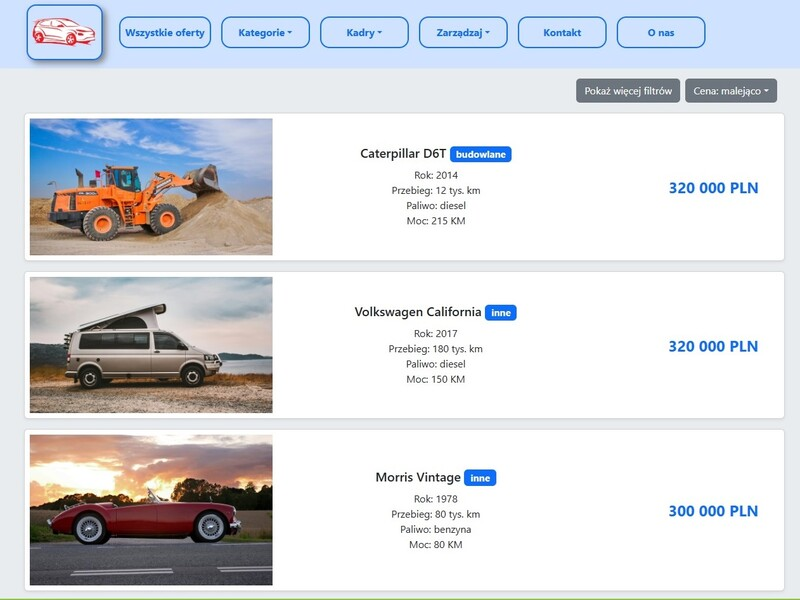

Readme PL -> [link](README.pl.md)

# Car Dealer Platform (React + TypeScript)

> ℹ️ Note: The application's user interface is currently in Polish only, but all source code is written in English for better readability and maintainability.

**Deployed at:** [adrian-mienkowski-rcd.vercel.app](https://adrian-mienkowski-rcd.vercel.app/)

A car listing platform inspired by otomoto.pl, built with React, TypeScript, and Bootstrap.  
This is a fully frontend application — all pages use a single mock API service that simulates a backend with full CRUD functionality.
    
<p align="center">
    
</p>

## Installation and Launch

**Requirements:**
- Node.js ≥ 18
- npm ≥ 9

**Build the project:**
```bash
npm install
npm run build
```

**Run in development mode:**
```bash
npm run dev
```

**Run production preview:**
```bash
npm run preview
```

## Key Components:

- `OffersPage` – displays the list of vehicle offers with sorting, pagination, and advanced filtering,
    <p align="center">
      
    </p>
- `FilterPanel` – reusable component with a form for filtering offers,
- `CreateOfferPage` – listing creator with layered validation; supports both adding and editing,
    <p align="center">
      
    </p>
- `OffersManagerPage` – management panel for adding and removing listings,
- `MockApiService` – provides vehicle data to the frontend,
- `OfferPage` – detailed view of a single listing,
    <p align="center">
      
    </p>
- `types` folder – shared types and enums used throughout the application.

## Technologies
- `React 19`
- `TypeScript`
- `Bootstrap 5`
- `Vite`

**Additional libraries:**
- `React Image Gallery`
- `Validator.js`
- `react-icons`

## To do
- refactor MockApiService to simulate paginated requests,
- add English language support for the UI.

⭐ Feel free to star this repo if you found it useful.
