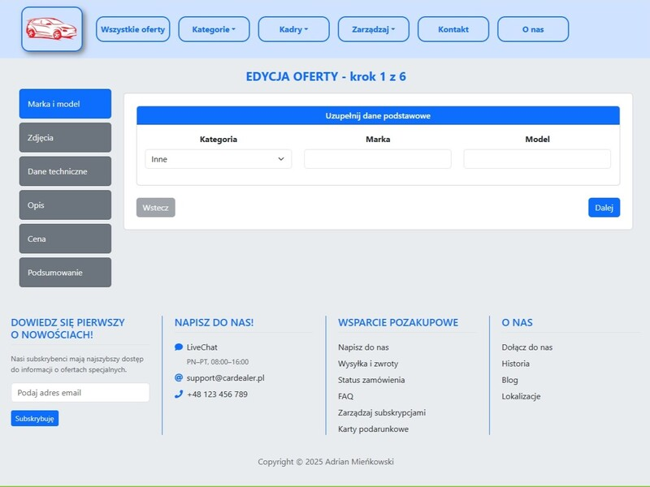

Readme ENG -> [link](README.md)

# Serwis ogłoszeniowy z samochodami (React + TypeScript)

**Zobacz online:** [adrian-mienkowski-rcd.vercel.app](https://adrian-mienkowski-rcd.vercel.app/)

Projekt serwisu ogłoszeniowego inspirowanego otomoto.pl, napisany w React z użyciem TypeScript i biblioteki Bootstrap.  
Aplikacja jest w 100% frontendowa – wszystkie podstrony korzystają z jednego serwisu mock API, który symuluje backend z pełnym zakresem operacji CRUD.

<p align="center">
    
</p>

## Instalacja i uruchomienie

**Wymagania:**
- Node.js ≥ 18
- npm ≥ 9

**Budowanie projektu:**
```bash
npm install
npm run build
```

**Uruchomienie w trybie developerskim:**
```bash
npm run dev
```

**Uruchomienie wersji produkcyjnej:**
```bash
npm run preview
```

## Najważniejsze komponenty:

- `OffersPage` – strona z listą ofert, zawiera sortowanie, paginację i zaawansowane filtrowanie,
    <p align="center">
      
    </p>
- `FilterPanel` – osobny komponent z formularzem do filtrowania ofert po szczegółach,
- `CreateOfferPage` – kreator ogłoszeń z warstwową walidacją, obsługuje dodawanie i edycję,
    <p align="center">
      
    </p>
- `OffersManagerPage` - panel zarządzania ofertami - dodawanie i usuwanie,
- `MockApiService` – serwis udostępniający dane o pojazdach,
- `OfferPage` – podstrona ze szczegółami ogłoszenia,
    <p align="center">
      
    </p>
- katalog `types` – zbiór wspólnych typów i enumów.

## Technologie
- `React 19`
- `TypeScript`
- `Bootstrap 5`
- `Vite`

**Dodatkowe, zewnętrzne biblioteki:**
- `React Image Gallery`
- `Validator.js`
- `react-icons`

## To do
- refactor `MockApiService` aby symulował requesty z paginacją,
- dodanie wersji językowej UI w języku angielskim.

⭐ Jeśli repozytorium okazało się przydatne, zostaw gwiazdkę!
